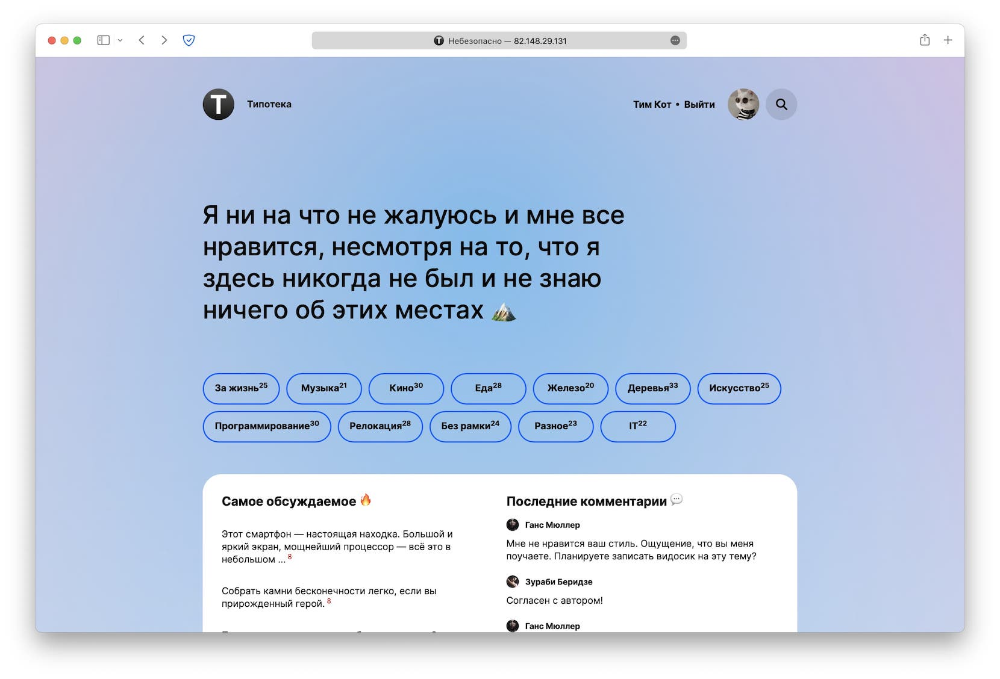

# Проект «Типотека» 

**Опубликованная версия доступна [тут](http://134.122.50.142/)**

<details>
<summary>Данные <a href="#roles">автора</a> для демо</summary>

```
test@test.ru — логин
test@test.ru — пароль
```
</details>


## О проекте

Типотека — приложение для публикации заметок. Это не только создание контента, любой желающий читатель может зарегистрироваться и оставить комментарии. Создавайте заметки, общайтесь с читателями, модерируйте контент вместе с «Типотека».




## Основные функции

- Просмотр публикаций
- Добавление и управление публикациями
- Обсуждение публикаций
- Поиск публикаций по наименованию

### <span id="roles">Роли пользователей</span>

- **автор** (первый зарегистрировавшийся пользователь после заполнения базы данных) — добавление, удаление, редактирование статей и комментариев
- **читатели** (авторизованные пользователи) - просмотр статей, добавления комментариев
- **гости** (неавторизованные пользователи) — просмотр статей


## Используемые технологии

- [Node.js](https://nodejs.org/en/) и [express.js](https://expressjs.com/) для создания REST API сервиса и SSR
- [PostgreSQL](https://www.postgresql.org/) для хранения данных пользователей и сеанса
- [Sequelize](https://sequelize.org/) для работы с моделями
- [eslint](https://eslint.org/), [jest](https://jestjs.io/ru/) для линтинга и тестирования, [husky](https://www.npmjs.com/package/husky) запуска тестов перед отправкой кода на github
- [pug.js](https://pugjs.org/) для шаблонизации
- [socket.io](https://socket.io/) для работы с WebSocket
- [pino](https://www.npmjs.com/package/pino) для создания логов
- [multer](https://www.npmjs.com/package/multer) для загрузки и обработки файлов
- [joi](https://www.npmjs.com/package/joi) — для валидации данных
- [csurf](https://www.npmjs.com/package/csurf) — защита CSRF, [bcrypt](https://www.npmjs.com/package/bcrypt) — генерация хеш-паролей


### Deploy

<a href="https://www.digitalocean.com/?refcode=f16d0084fa8a&utm_campaign=Referral_Invite&utm_medium=Referral_Program&utm_source=badge"></a>

Демо размещено на VDS от [DigitalOcean](https://m.do.co/c/f16d0084fa8a) на Ubuntu 22.04 c использованием [Nginx](https://nginx.org/) и менеджера процессов [PM2](https://pm2.keymetrics.io/)


## Разработка

Проект в первую очередь разработывался для изучения Node.js и Express, однако я буду рад замечаниям и внесению изменений. Для разработы или запуска приложнеия необходимо: 

- [Node.js](https://nodejs.org/en/) 16.13
- [PostgreSQL](https://www.postgresql.org/) 14.1
- [PM2](https://pm2.keymetrics.io/) 5.2 (опционально)

### Развертывание

1. скопируйте репозиторий
2. установите зависимости с помощью `npm install`
3. подготовте БД
    - создайте базу данных и пользователя БД. В качестве примера можно воспользоватся SQL командами из [create-db.sql](https://github.com/dreadwood/typoteka/blob/master/sql/create-db.sql) введеными через [psql](https://www.postgresql.org/docs/current/app-psql.html)
    - обновите переменные окружения в [.env](https://github.com/dreadwood/typoteka/blob/master/.env) согласно описанию [environments.md](https://github.com/dreadwood/typoteka/blob/master/environments.md)
    - если необходимо, заполните базу данных моковыми данными: воспользуйтесь `npm run cli --filldb <count>`, где `<count>` — колличество сгенерированных постов
    - укажите адрес сервера для работы [socket.io](https://socket.io/). Вероятно он соответвует доменному имени (или `localhost` при разработке)
4. запустите через PM2 REST и API сервисы командой `npm start` для production режима. Для режима разработки можно исползовать `npm run start-servers::debug`: будет использоваться пакет [nodemon](https://www.npmjs.com/package/nodemon) перезагружая сервисы после внесения изменений

### Основные команды

- `npm start` — запуск REST и SSR сервисов
- `npm test` — запуск линтера и тестов (eslint и jest)
- `npm run start-servers::debug` — запуск REST и SSR сервисов в режиме разработки
- `npm run css` — генерация css (используется sass) для SSR
- `npm run cli` — консольное приложение для генерации моковых данных в виде json или заполнение в базу данных (PostgreSQL)
    - `--generate <count>` — формирует файл mocks.json
    - `--server <port>` — запуск сервера на указаном и дефолтном порту
    - `--fill <count>` — формирует файл fill-db.sql для заполнения базы данных
    - `--filldb <count>` — создает базу данных и заполняет её моковыми данными

### Файлы

- `environments.md` — описание переменных окружения

### Каталоги:

- `src/service` — REST и CLI приложения
- `src/express` — SSR приложение
- `data` — данные для создания моковых данных
- `markup` — первоначальный макет (html, css, js, fonts)
- `log` — логи ошибок (только для production режима)
